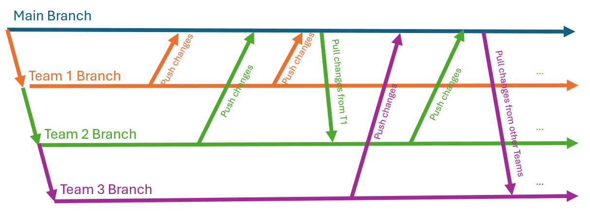

# Academic Chat Bot

This chatbot functions as an academic tool that processes YouTube videos, enabling users to engage interactively with the content. For instance, after analyzing a playlist on linear algebra, users can ask specific questions such as, *"How do I solve a system of linear equations?"* The bot will then provide explanations based on the video content and direct users to the relevant sections of the video for further information.

## Basic Project Structure

- frontend
- rag
- data_pipeline
- vector_db
- graph_db

## Get Started

- Clone project:
`git clone https://github.com/dneumnn/AcademicChatBot.git`
- Create a virtual envrionment for the project:
`conda create -n academic_chat_bot python=3.11`
- Activate the virtual environment for the project:
`conda activate academic_chat_bot`
- Adjust git credentials:
`git config user.name <your name>`
`git config user.email <your email>`
- Install dependencies
`pip install -r requirements.txt`
- Start the FastAPI
`uvicorn main:app --reload`

## Dependency Managements

1. Install packages from requirements.txt:
`pip install -r requirements.txt`
2. Write new package dependencies into the requirements.txt **without** their following dependencies. They will automatically get installed with `pip install -r`.

## Git Branching Modell - Feature Branching

- There are five projects, each housed in its own subfolder to avoid merging conflicts.
- Each team has its own dedicated branch.
- Developers should commit regulary, ensuring that each commit is small and focused on a single topic.
- Commits should be written in present tense.
- After completing a feature, teams merge their updates into the main branch.
- Teams should notify others vai MS Teams when they release a new feature that could be important for teams.
- To utilize features developed by other teams, a team should merge these updates into their own branch.

